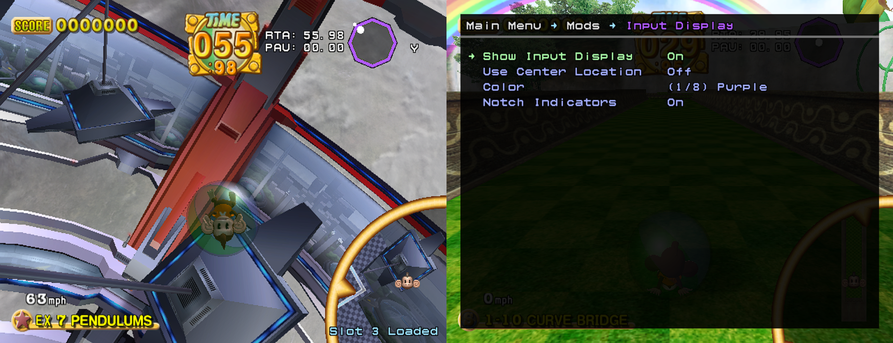

# :confetti_ball: Super Monkey Ball 2 Practice Mod

A Super Monkey Ball 2 mod for speedrun practice and general experimentation. It supports vanilla SMB2 and romhacks (Gaiden, SMB651, etc).

Features include:

* Savestates
* Input Display
* Story Mode Individual World (IW) Practice
* Challenge Mode Individual Segment Practice
* Stage RTA and Pause Timers
* Background Music Toggle
* [Jump Mod](https://www.youtube.com/watch?v=kWAunK6Av-Q)
* Debug Mode
* Freeze Timer
* Quick Rumble Adjust
* D-pad Controls
* Frame Advance

... and more! Features can be toggled on/off and configured as you desire.

# Install

To install the mod on a **Wii console** (recommended), follow [this guide](doc/console-setup-guide.md). There's also
a [video guide](https://www.youtube.com/watch?v=BwI_HtiMUiQ&list=PL7BL-I_VX5tNeBwc7jlweIXvf59QG_dMG&index=1) but it's a
bit out-of-date.

To install the mod on **Dolphin Emulator**, follow [this guide](doc/dolphin-setup-guide.md).

# Usage

Press L+R at the same time on your controller to toggle the in-game menu. Go to the Help menu to see controller bindings
for savestates and for other features. For individual-world practice, head to Story Mode and press Up/Down on a savefile
to change world.

Be sure to look for the Easter egg!

# Building

To build from source, see [this guide](doc/building.md).

# Contact

If you have any questions, bugs, or feature requests, feel free to message me on Discord (`ComplexPlane#3111`) or
email (`complexplanegames@gmail.com`). You can also file a Github issue.

# Credits

Thank you to:

**Zephiles** for their numerous code contributions. These include:

* The initial [TTYD-Practice-Codes](https://github.com/Zephiles/TTYD-Practice-Codes) framework of which this mod is
  based on
* The current REL loader Gecko code
* A custom heap implementation for the mod
* A revised REL loader which serves as both a Gecko and ISO loader (not yet included)
* A Super Monkey Ball 1 port of the REL loader (not yet included)

**PistonMiner** for their [ttyd-tools](https://github.com/PistonMiner/ttyd-tools) framework, which provides everything you need to turn C++ into a .GCI savefile which can be loaded into a Gamecube game at runtime. In addition, thanks very much for the detailed answers to my romhacking-related questions.

**CraftedCart** for their substantial contributions to the Monkey Ball 2 decompile project, as well as the many large contributions to the Monkey Ball hacking and custom level scene on the whole.

**Yoshimaster96** for labelling hundreds of functions and data in Super Monkey Ball 1, many of which were ported to Super Monkey Ball 2.

**TheBombSquad** for their decompile contributions as well, and for writing the current version of the ISO REL loader.

**Alist** and **PetresInc** for providing insightful feedback on a pre-release alpha needed before publishing an initial beta version of the mod.

**The Monkey Ball Speedrunning Scene** for inspiring this mod! Thank you for being so fun to be a part of.
